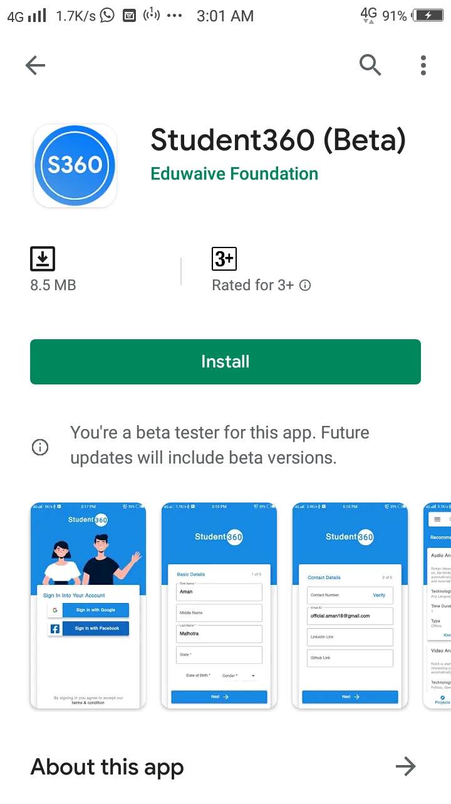
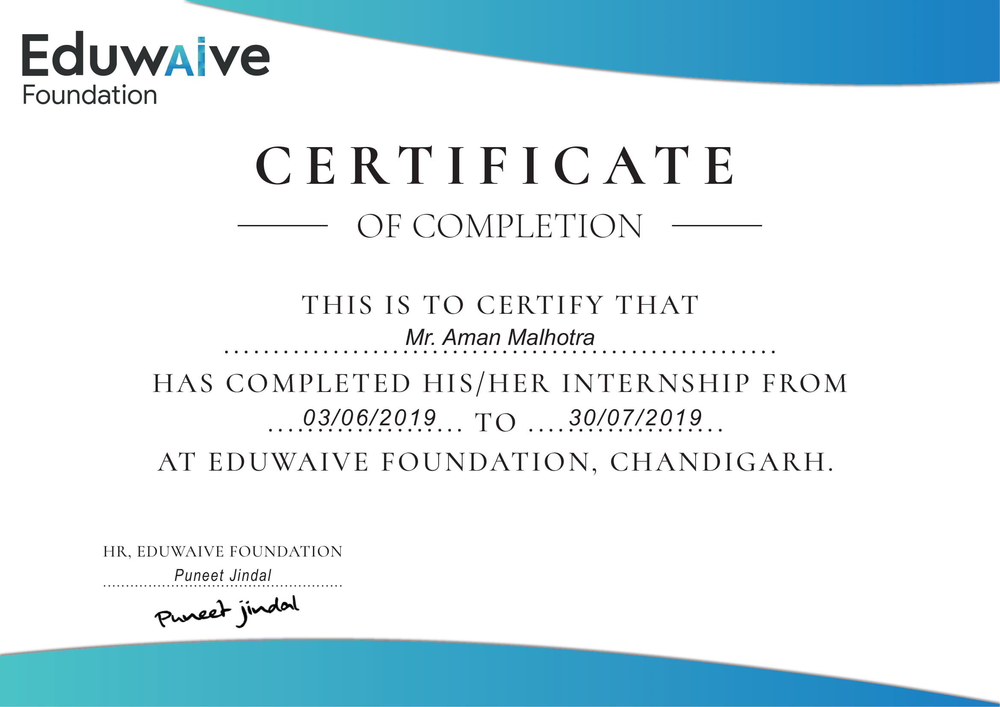
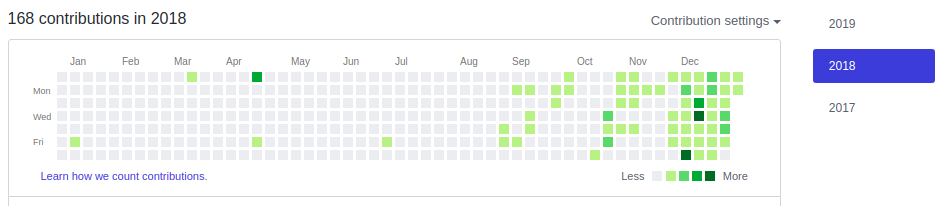
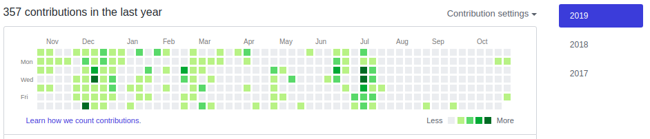
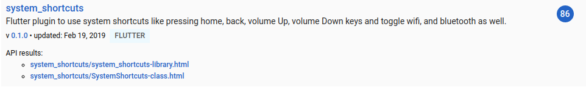

## UDEMY - Flutter in 7 days 
https://www.udemy.com/course/flutter-in-7-days/

| InEars - MUSIC PLAYER | STUDENT360 |
|-----------------------|------------|
| https://play.google.com/store/apps/details?id=com.amanmalhotra.inears|https://play.google.com/store/apps/details?id=com.eduwaivefoundation.s360|
| |  |

## HACKATHON THAPAR(2nd Position)
#### Our team of 3 members backed 2nd position in Startup Punjab Hackathon held at Thapar University, Patiala.

## STACK OVERFLOW
https://stackoverflow.com/users/7940500/aman-malhotra

## INTERNSHIP
https://student360.eduwaive.org/home

## SESSIONS held in Punjabi University, Patiala

## FLUTTER CREATE EVENT

## HACKER RANK
https://www.hackerrank.com/Aman_malhotra

## GITHUB
https://github.com/aman-malhotra

## FLUTTER PLUGINS
https://pub.dev/packages/volume

https://pub.dev/packages/system_shortcuts

https://pub.dev/packages/bass_boost

## JAVA CALENDER PROJECT
https://github.com/Aman-Malhotra/Calender

## STARTUP PUNJAB HACKATHON APP
https://github.com/Aman-Malhotra/Ceekers-THAPAR

